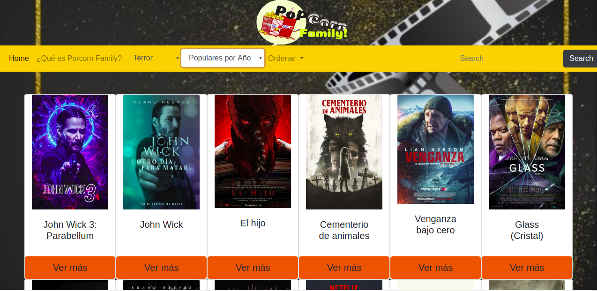
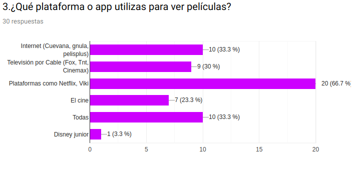
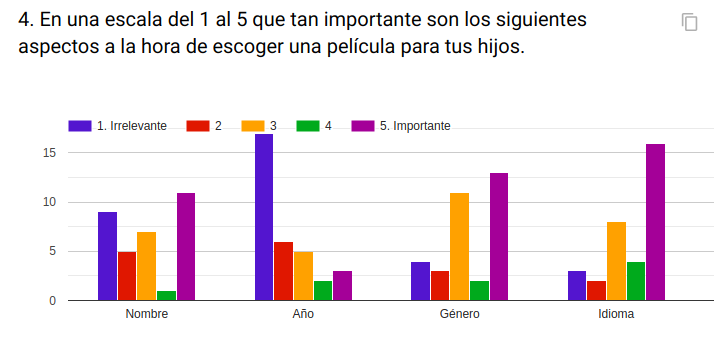

# BienVenidos a PopCorn Family!

## *¿Qué es PopCorn Family?*

*PopCorn Family* Es una aplicación web dirigida para toda la familia, en dónde podrás visualizar la información filtrando por género, las películas más populares por año, y las más votadas.

## Modo de Uso:

Para comenzar a utilizar la aplicación, dirigete a las opciones de selección que se encuentran en la parte superior, aquí podrás seleccionar la acción que desees ejecutar, por ejemplo si quieres filtrar por género esta opción te dirigirá a un selector que se desplegara con los parámetros a elección; también puedes filtrar por año, las más aclamadas por la audiencia y también podrás buscarlas por nombre.

Luego se desplegarán en la pantalla las películas Aparecerán en pantalla la o las imagenes que coincidan con tu busqueda. Para acceder a la información de la pelicula haz click en la imagen y se desplegará la información adicional.

## Planificación del Proyecto

Para poder optimizar de mejor manera el proyecto distribuimos las tareas y organización a través de [Trello](https://trello.com/b/PPajF3na/hackaton).

## Definición Usuarios

Para poder conocer y llegar a nuestro usuario realizamos una encuesta online para poder delimitar cuál es el tipo de información que requiere nuestro usuario o espera poder obtener de la interfaz que diseñamos, y poder también dirigirnos a un grupo etario promedio.
El rango etario en su mayoría predominante resulto entre 20- 38 años, de esta forma nos permitió enfocarnos mejor.

## Fase Prototipado

</a>

## Historias de usuario

