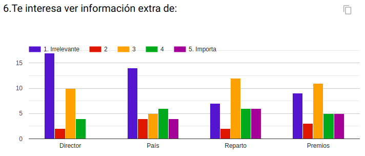
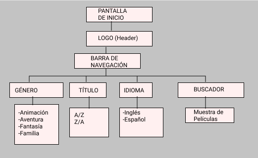

# BienVenidos a PopCorn Family!

## *¿Qué es PopCorn Family?*

*PopCorn Family* Es una aplicación web dirigida para toda la familia, en dónde podrás visualizar la información filtrando por género, las películas más populares por año, y las más votadas.

## Modo de Uso:

Para comenzar a utilizar la aplicación, dirigete a las opciones de selección que se encuentran en la parte superior, aquí podrás seleccionar la acción que desees ejecutar, por ejemplo si quieres filtrar por género esta opción te dirigirá a un selector que se desplegara con los parámetros a elección; también puedes filtrar por año, las más aclamadas por la audiencia y también podrás buscarlas por nombre.

Luego se desplegarán en la pantalla las películas Aparecerán en pantalla la o las imagenes que coincidan con tu busqueda. Para acceder a la información de la pelicula haz click en la imagen y se desplegará la información adicional.

## Planificación del Proyecto

Para poder optimizar de mejor manera el proyecto distribuimos las tareas y organización a través de [Trello](https://trello.com/b/PPajF3na/hackaton).

## Definición Usuarios

Para poder conocer y llegar a nuestro usuario realizamos una encuesta online para poder delimitar cuál es el tipo de información que requiere nuestro usuario o espera poder obtener de la interfaz que diseñamos, y poder también dirigirnos a un grupo etario promedio; en un principio optamos por dirigirnos aun grupo familiar, es decir a encuestas para padres, pero en el camino la encuesta y los feedbacks recibidos nos derivamos a usuarios que quisieran compartir más.

El rango etario en su mayoría predominante resulto entre 20- 38 años, de esta forma nos permitió enfocarnos mejor.

En esta pregunta queriamos buscar el enfoque, acerca de cual es la plataforma más utilizada, las alternativas mas predoninantes fueron: Netflix, Internet y televisión por cable.

En esta pregunta buscabamos obtener tres parámetros para enfocarnos, las alternativas eran: título, año, género e idioma; y en base a los resultados obtnenidos decidímos hacerlo por género y año.

Por último, esta pregunta nos permitió obtener el último parámetro que es el de prioms o las películas más votadas y estableciendo un ranking.

## Fase Prototipado

Iniciamos la fase de prototipado después de reconocer al usuario; avanzamos con el proceso de la creación, paso a paso para dar con el resultado esperado con nosotras, enfocado principalmente en el usuario.

*Diagrama de flujo*: es un bosquejo que permite visualizar los elementos que tendrá la interfaz, teniendo en cuenta los posibles cambios en la filtración.

## Historias de usuario

Entonces luego de analizar nuestras encuestas, se desarrollan distintas historias de usuario que nos permiten ver las necesidades, y encontrar la forma a través de los criterios de aceptación lograr resolver.

Durante el proceso de PopCorn Family, nacieron nuevas historias de usuario que nos permitieron desarrollar aún más la página y volverla más activa.

*Historia de Usuario 1*: Yo como fanático del cine de animación quiero utilizar esta aplicación para poder acceder a la información desde mi hogar.
*Criterios de Aceptación*: Crear la base de HTML, definiendo cada pantalla de la utilización del Filtro y creación de modal.

*Historia de Usuario 2*: Yo como fanático del cine me gustaría poder filtrar las películas por género y así conocer más y poder ampliar el conocimiento del mundo del cine.
*Criterios de aceptación*: en html crear en el navbar un selector que permita filtrar por género.

*Historia de Usuario 3*: Yo como aficionado del cine de terror me gustaría poder ver  las películas más aclamadas.
Criterios de Aceptación: Crear un selector que permita ver las películas mejor evaluadas por la critica.

*Historia de Usuario 4*: Yo como aficionada del cine para mis hijos quiero poder filtrar por género y año, y así poder ver diferentes películas con más historias.
*Criterios de Aceptación*: Luego de crear un selector para filtrar por género, Crear un selector donde el usuario pueda filtrar por año. 

*Historia de usuario 5*: Yo como aficionada a las películas de aventura, acción y ciencia ficción, quiero ver la ficha de las películas que seleccioné y conocer más sobre ellas.
*Criterios de aceptación*: Se creará un modal que se desplegará al momento de seleccionar por el usuario una opción de película; luego se mostrara una ficha con las características de la película.

## Fase de Prototipado

- Prototipo de Baja Fidelidad

Usando el diagrama de flujo como guia, y las encuestas, a través de papel, creamos un boceto con los diferentes usos, e interfaces que se veran en la aplicación.

- Prototipo de Alta Fidelidad

Después que se reconoce al usuario se crea en Figma el prototipo de Alta Fidelidad, donde se definieron los colores, el tipo de información a entregar y como lograr entregarla de forma ordenada y apropiada al usuario. 
En base al fedback entregado por las entrevistas con el prototipo de baja fidelidad, se hicieron algunos cambios.

Desarrollado en Figma, y exportado a Zeplin [aquí puedes visualizar]()

Tareas a realizar:
-
-
-
-
Problemas observados:

Videos:
-
-
-
##Consideraciones:

*Utilización de la Interfaz : HTML, JS, CSS.*
- HTML: se utiliza para darle formato a la página; trabajo responsive y utilización de Bootstrap; unión de JS y Css.

- JS: manejo del Dom, y uso de la API() 
- CSS: es utilizado para el manejo de los estilos, para la página, es responsive.

*Hackaton:* trabajo colaborativo, utilizando Git y GitHub

Implementación de la aplicación 
[Aquí]() puedes acceder al deploy en gh-pages.

